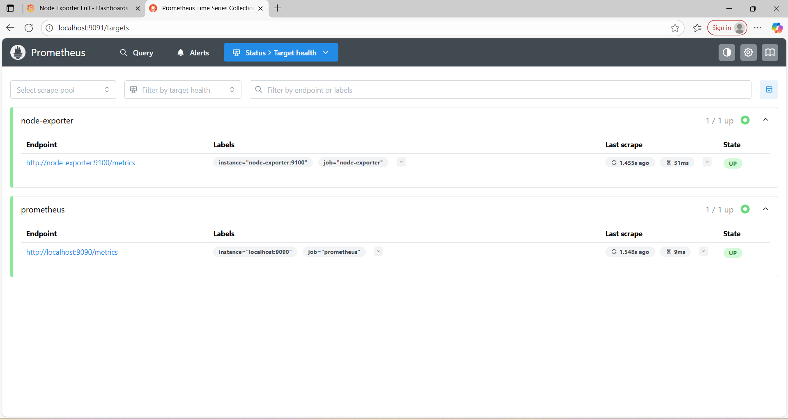
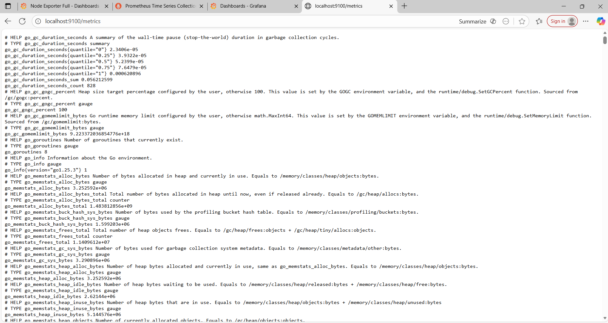
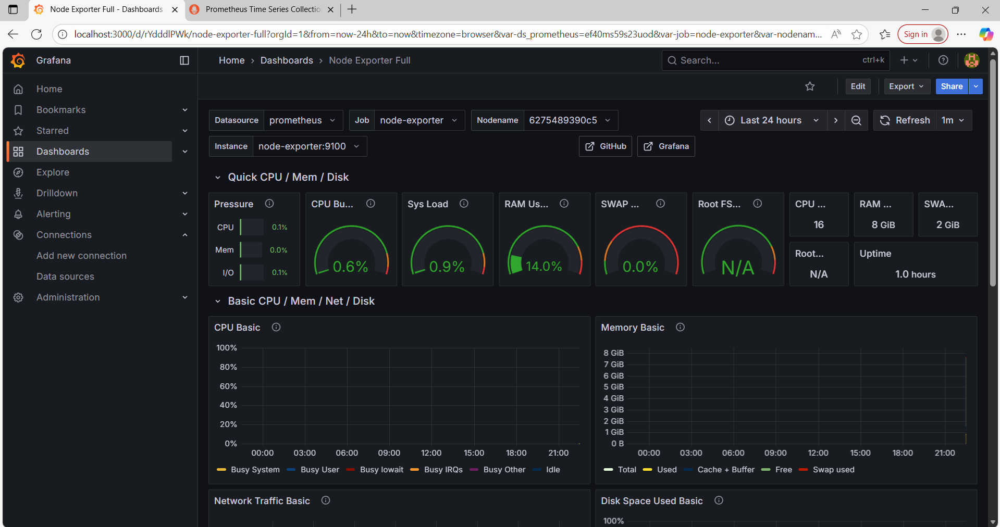

# 🖥️ System Monitoring Dashboard

A complete system monitoring solution using **Prometheus**, **Grafana**, and **Node Exporter** with Docker Compose.

## 🚀 Tech Stack

- **Docker** - Containerization
- **Prometheus** - Metrics collection and storage
- **Grafana** - Data visualization and dashboards
- **Node Exporter** - System metrics exporter

## ⚡ Quick Start

1. **Clone the repository**
   ```bash
   git clone https://github.com/your-username/system-monitoring-dashboard.git
   cd system-monitoring-dashboard
   ```

2. **Start all services**
   ```bash
   docker-compose up -d
   ```

3. **Access the services**
   - 📊 **Grafana**: [http://localhost:3000](http://localhost:3000)
   - 🔍 **Prometheus**: [http://localhost:9091](http://localhost:9091)
   - 📈 **Node Exporter**: [http://localhost:9100](http://localhost:9100)

## 🔧 Configuration

### Grafana Setup
- **Default Login**: `admin` / `admin`
- **Add Data Source**: `http://prometheus:9090`
- **Import Dashboard**: Use Node Exporter Dashboard ID `1860`

### Prometheus Configuration
The `prometheus.yml` file includes:
- Self-monitoring of Prometheus
- Node Exporter metrics collection
- 5-second scrape interval for real-time monitoring

## 📊 Features

- ✅ Real-time system metrics monitoring
- ✅ CPU, Memory, Disk, and Network monitoring
- ✅ Beautiful Grafana dashboards
- ✅ Docker containerized setup
- ✅ Easy to deploy and scale

## 🧩 Project Level

**✅ Level: Advanced (for Fresher)**

This project showcases strong knowledge of DevOps tools and container orchestration. It demonstrates the ability to monitor and visualize infrastructure metrics using real-world tools.

## 🛠️ Project Structure

```
system-monitoring-dashboard/
├── docker-compose.yml    # Docker services configuration
├── prometheus.yml        # Prometheus configuration
└── README.md            # Project documentation
```

## 📸 Dashboard Preview

### 📊 Grafana Dashboard


### 🔍 Prometheus Targets


### 📈 Node Exporter Metrics


### 🖥️ System Overview


## 🚦 Services Status

After running `docker-compose up -d`, verify all services:

```bash
docker-compose ps
```

## 🔄 Commands

```bash
# Start services
docker-compose up -d

# Stop services
docker-compose down

# View logs
docker-compose logs -f

# Restart services
docker-compose restart
```

## 🤝 Contributing

1. Fork the repository
2. Create your feature branch
3. Commit your changes
4. Push to the branch
5. Open a Pull Request

## 📝 License

This project is open source and available under the [MIT License](LICENSE).

---

## 👩‍💻 Created By

**Tanisha Kushwah**

---

⭐ **Star this repo if you found it helpful!**